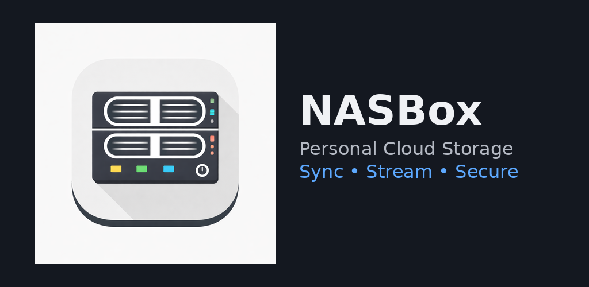
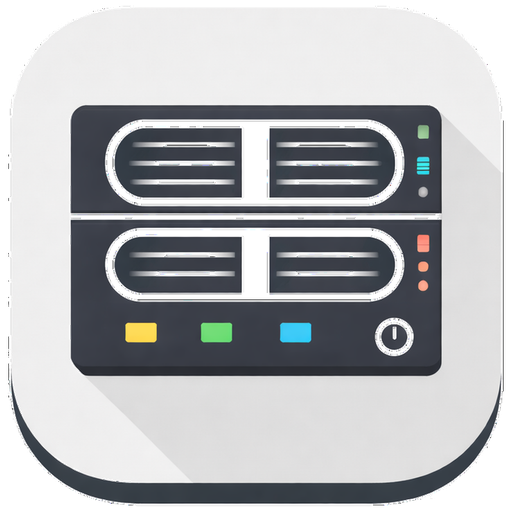

# NASBox

NASBox is an Android app for backing up local device content to SMB 2/3 network shares.

The app is built with Kotlin, Jetpack Compose, Room, WorkManager, and SMBJ. It supports configuring SMB destinations, creating backup plans, and running archive-only sync jobs for photo albums, general folders, and broad shared-storage backups.

## Visuals



<p align="center">
  
</p>

## What it does

- Stores SMB server definitions with credential support and connection testing
- Discovers reachable SMB hosts on the local network
- Browses remote shares before saving a destination
- Creates backup plans for photo albums, document-tree folders, and shared-storage "full phone" style backups
- Runs manual backups with persisted run history and per-run counters
- Deduplicates uploads using persisted backup records
- Shows active and recent runs from the dashboard, including stop/cancel controls

## Developer setup

Requirements:

- Android Studio with a recent Android SDK install
- Android SDK 35
- JDK 11

Clone the repo and build from the project root:

```bash
./gradlew assembleDebug
```

Install to a connected device or running emulator:

```bash
./gradlew installDebug
```

Physical Android devices are strongly preferred for validating SMB discovery and LAN behavior. Emulator networking can interfere with broadcast, multicast, mDNS, and general subnet reachability.

## Runtime notes

- Minimum SDK is Android 7.0 (API 24)
- Target and compile SDK are 35
- The app requests media permissions only when needed for plan creation
- On Android 13+, media access uses granular permissions such as `READ_MEDIA_IMAGES` and `READ_MEDIA_VIDEO`
- On Android 12 and lower, media access falls back to `READ_EXTERNAL_STORAGE`
- SMB host input accepts either a plain hostname/IP or an SMB URI such as `smb://nas.local/share`
- Share browsing prefers SRVSVC `NetShareEnum` over `IPC$`, then falls back to SMBJ `listShares`

## Project layout

- `app/src/main/java/skezza/nasbox/ui/` Compose screens, view models, and navigation
- `app/src/main/java/skezza/nasbox/domain/` use cases and sync orchestration
- `app/src/main/java/skezza/nasbox/data/db/` Room entities, DAOs, and database wiring
- `app/src/main/java/skezza/nasbox/data/repository/` repository interfaces and implementations
- `app/src/main/java/skezza/nasbox/work/` WorkManager jobs and notification actions
- `app/src/test/java/` JVM tests
- `app/src/androidTest/java/` instrumentation tests

## Testing

Run the full test suite:

```bash
./gradlew test
```

Run core sync and dashboard tests directly:

```bash
./gradlew testDebugUnitTest --tests "skezza.nasbox.domain.sync.RunPlanBackupUseCaseTest" --tests "skezza.nasbox.domain.sync.StopRunUseCaseTest" --tests "skezza.nasbox.ui.dashboard.DashboardViewModelTest" --tests "skezza.nasbox.ui.dashboard.DashboardRunDetailViewModelTest"
```

If a test fails locally, prefer checking whether it depends on Robolectric, Android framework behavior, or Room-specific Android wiring before treating it as an app regression.

## Related docs

- `project_plan.md` for the original implementation roadmap
- `technical_considerations.md` for architecture and behavioral constraints
- `codex.md` for local implementation guardrails
