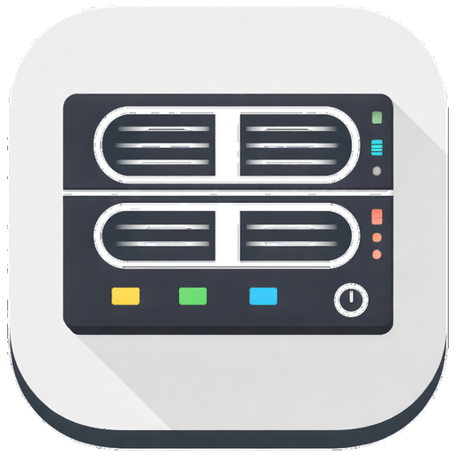

# NASBox
Archive-only sync jobs for photo albums, general folders, and broad shared-storage backups. Good opportunity to trial Codex 5.3. 

  

## Developer setup

Clone the repo and build from the project root.

#### Related docs

- `project_plan.md` -> original implementation roadmap
- `technical_considerations.md` -> architecture and behavioral constraints
- `codex.md` -> local implementation guardrails
